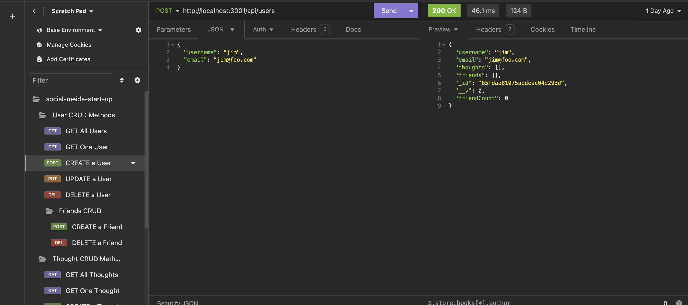
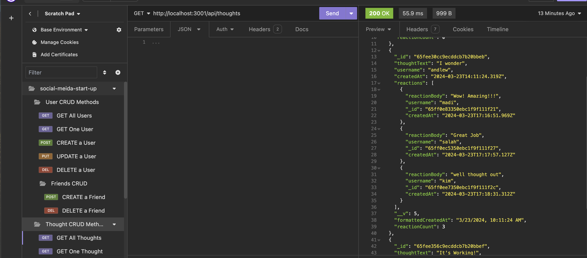

# Social-Media-Start-Up

## Building the Back End of a Social Media Start-up

The purpose of this project is to create the backend of a social media application. The Social Media Start-Up is designed to implement Create, Read, Update, and Delete (CRUD)in the backend of a social media application. CRUD was implemented with the User and Thought Models. For the friends and reactions, the only required methods were POST and Delete. Developing this project demonstrates our ability to use MongoDB, Mongoose, Express, and Insomnia for testing.

The following is an image of a CRUD operation of the social media application.

The Following image are the list of notes created that includes the notes form.

## Installation

N/A

## Usage

To view the application in action, simply click the following link: **ADD LINK**
The link will redirect you to the demonstration walkthrough video of the application. The Social Media Start Up application implements the CRUD operation. 

## Credits

N/A

## License

Please refer to the LICENSE in the repo.